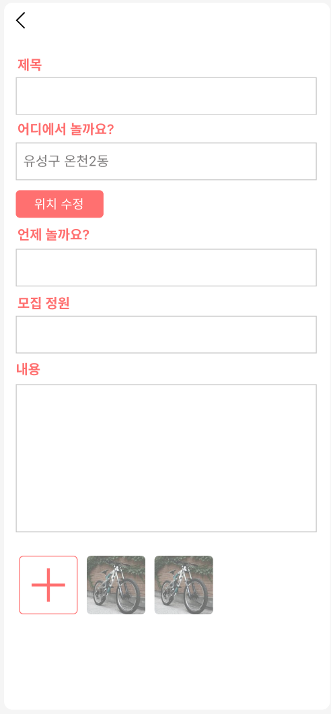

# 놀자Go 프론트엔드 (Vite + React)

**우리동네 놀이팟 모집 서비스, 놀자Go**

---

## 1. 서비스 소개 및 주요 화면

놀자Go는 **동네에서 함께 놀 사람을 가장 빠르게 모으는 서비스**예요.  
지금 내 주변에서 어떤 놀이가 열리고 있는지 한눈에 보고, 원하면 바로 놀이팟을 만들고 참여할 수 있어요.

- **메인 화면**  
    
  동네별 놀이팟을 리스트로 확인하고, 글쓰기 버튼으로 바로 모집글을 올릴 수 있어요. 지금 가까운 곳에서 실제로 진행 중이거나 곧 시작될 놀이에 집중해요.

- **놀이팟 등록**  
    
  제목·일시·장소·내용·사진을 한 번에 입력해 약속 정보가 분명한 모집글을 만들 수 있어요.

- **주변 놀이팟 찾기**  
    
  지도에서 내 위치를 기준으로 주변 놀이팟을 바로 확인할 수 있어요. “같은 동네”가 아니라 “지금 만날 수 있는 거리”를 기준으로 보여줘요.

- **채팅방**  
    
  모집글마다 전용 단체 채팅방이 자동으로 만들어져요. 이동·시간 변경 같은 상황도 실시간으로 공유할 수 있어요.

- **추억**  
    
  함께한 놀이의 사진·영상을 모아보고, 놀이 경험이 일회성으로 끝나지 않도록 기록해요.

---

## 2. 문제 정의

요즘 많은 사람들이 **당근 앱을 통해 놀이팟을 구하고 있어요.** 하지만 당근에서 놀이팟을 구하는 방식에는 구조적인 한계가 있어요.

사람들은 보통 이렇게 놀이팟을 만들어요.

- 동네게시판에 모집글을 올리고
- 댓글이나 1:1 채팅으로 약속을 잡아요

하지만 막상 모이려고 하면,

- 누가 몇 명이나 오는지 끝까지 알기 어렵고
- 정확한 놀이 장소가 애매해지고
- 이동이나 시간 변경을 실시간으로 공유하기 어렵고
- 무엇보다 **놀이를 위한 UX가 아니라 중고거래 UX 위에서 억지로 사용**하고 있어요.

즉, **놀기 위해 모이는데, 놀기에 최적화된 서비스는 없다**는 것이 핵심 문제예요.

놀이를 목적으로 사람을 모으는 과정이 여전히 ‘글 + 댓글 + 개인 채팅’에 머물러 있고, 이 방식은

- 즉흥적인 놀이에 느리고
- 장소·시간·인원 관리가 불안정하며
- 실제 놀이 경험까지 자연스럽게 이어지기 어렵다는 한계를 가지고 있어요.

---

## 3. 놀자Go는 무엇이 다른가요?

놀자Go는 **동네 커뮤니티가 아니라, 놀이 행동 자체에 집중**해요. 그래서 문제를 이렇게 풀었어요.

### ① 약속 정보를 처음부터 명확하게 만들어요
놀이팟을 만들 때 주제, 인원, 시간, 장소를 반드시 입력하도록 설계했어요. 덕분에 “언제 어디서 만나는지”가 모호해지지 않아요.

### ② 놀이의 ‘성격’을 드러낼 수 있어요
해시태그와 모집글로 체력·숙련도·분위기(예: 저질 체력도 환영, 운동부 출신만)를 표시할 수 있어요. 각자에게 맞는 놀이팟을 고르기 쉬워요.

### ③ 모집 → 위치 → 채팅이 하나의 흐름으로 이어져요
모집글, 지도 위치, 단체 채팅이 하나의 UX로 묶여 있어요. 이동이나 변경 사항도 같은 공간에서 바로 공유할 수 있어요.

---

### 한 줄로 요약하면
> 당근은 동네 사람을 연결해요.  
> 놀자Go는 지금 놀 사람을 모아요.

---

## 개발 환경 실행

```bash
npm install
npm run dev
```

브라우저에서 `http://localhost:3001`로 접속하면 됩니다. 로그인 → 회원가입 → 메인 → 등록/지도/채팅/마이페이지 흐름을 순서대로 체험할 수 있습니다.

## 구성

- `src/screens/*`: 각 시안 화면을 컴포넌트로 분리.
- `src/components/*`: 하단 네비게이션, 공통 버튼/레이아웃 등.
- `src/styles/global.css`: 컬러 변수, 기본 타이포그래피, 공통 UI 스타일 정의.

### 주의

- 현재는 정적 목업 상태이며, 실제 API 연동이나 인증 로직은 없습니다.
- 일부 화면의 이미지/아이콘은 플레이스홀더이며, 실제 자산을 받으면 `assets` 경로에 교체해 주세요.
